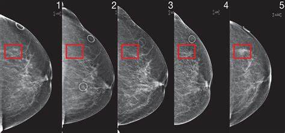

# Breast Cancer Classification Dataset  

## 📄 Descripción  

    

El cáncer de mama es el tipo de cáncer más común entre las mujeres a nivel mundial, representando el **25% de todos los casos de cáncer**. En 2015, afectó a más de **2.1 millones de personas**. Este tipo de cáncer se origina cuando las células en el tejido mamario comienzan a crecer de manera descontrolada, formando tumores que pueden detectarse mediante rayos X o palpación de bultos en la zona mamaria.  

El principal desafío en su detección radica en clasificar correctamente los tumores como **malignos (cancerosos)** o **benignos (no cancerosos)**. Este proyecto utiliza **machine learning**, específicamente **Máquinas de Soporte Vectorial (SVMs)**, junto con el **Breast Cancer Wisconsin (Diagnostic) Dataset** para abordar este problema.  

## 🎯 Objetivos  

1. **Explorar y limpiar el dataset** para preparar los datos para el análisis (si es necesario).  
2. Construir **modelos de clasificación** para predecir si un tumor es **maligno** o **benigno**.  
3. Realizar **afinación de hiperparámetros** y comparar las métricas de evaluación entre diferentes algoritmos de clasificación.  
